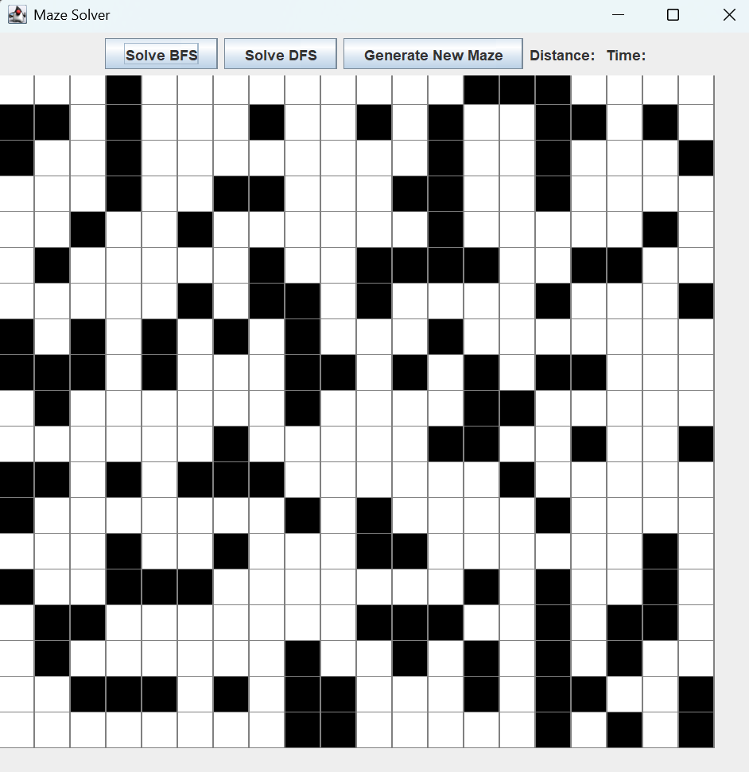
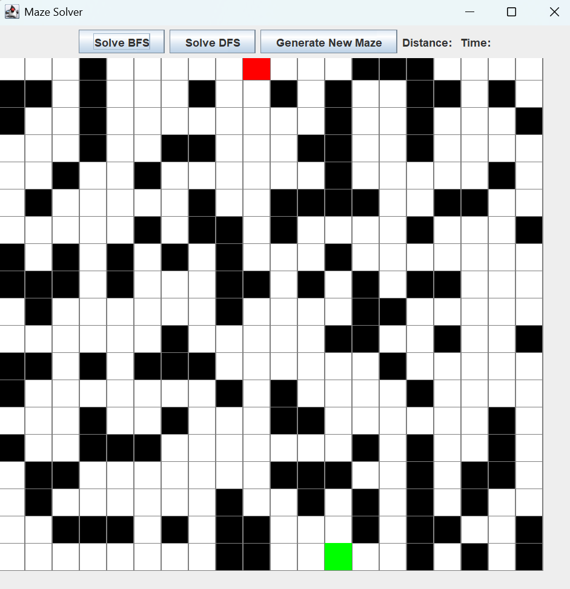
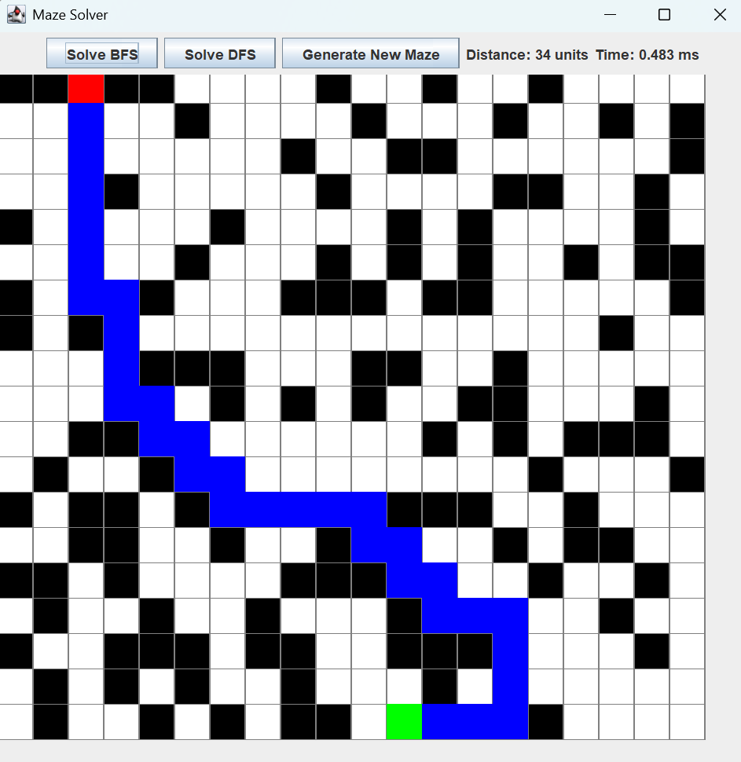
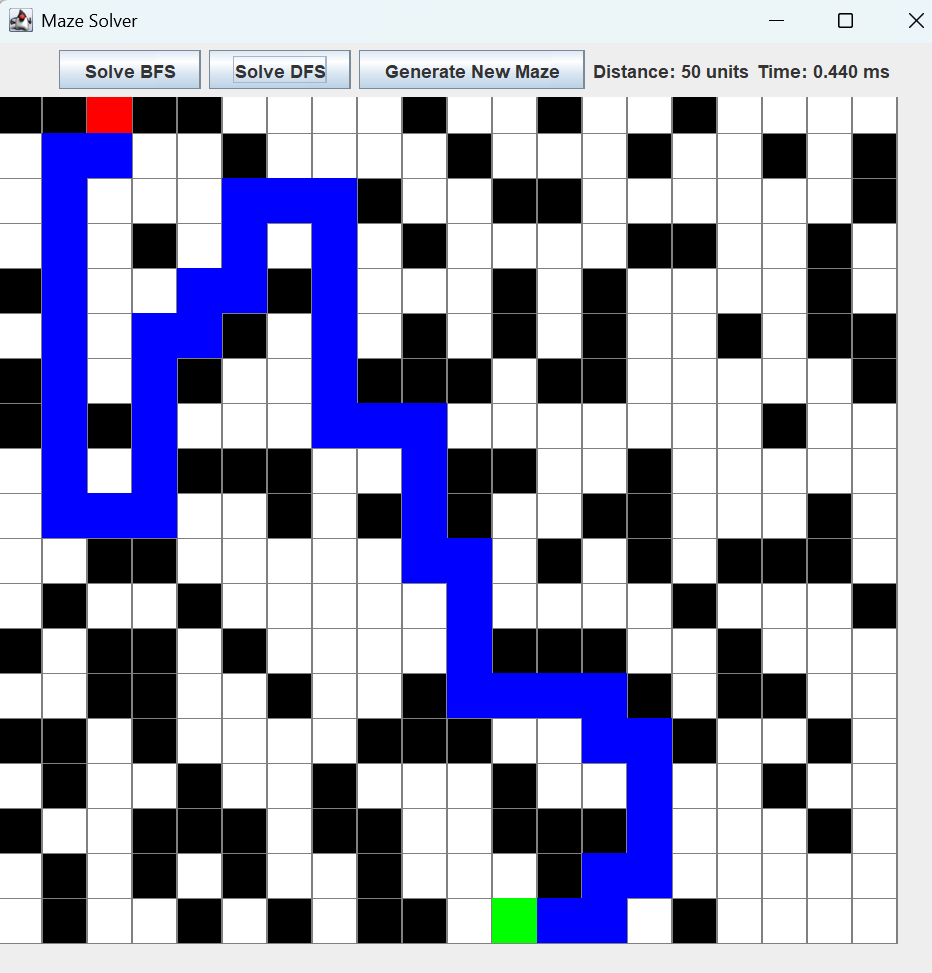

# PathForge

PathForge is a Java-based GUI application that allows users to generate and solve mazes using Breadth-First Search (BFS) and Depth-First Search (DFS) algorithms. The application provides a simple and interactive way to visualize pathfinding algorithms in action.

## Features
- **Maze Generation**: Generates a random maze with obstacles.
- **Interactive Start/End Selection**: Users can set the start and end points by clicking.
  - **Left-click** to set the **Start Point** (Green).
  - **Right-click** to set the **End Point** (Red).
- **Algorithm Visualization**:
  - Solve the maze using **BFS** (Shortest path guaranteed).
  - Solve the maze using **DFS** (May not find the shortest path).
- **Performance Metrics**:
  - Displays the distance of the found path.
  - Displays the execution time of the algorithm.
- **Graphical User Interface**: Built using **Java Swing**.

## Installation & Usage
### Prerequisites
- Java Development Kit (JDK) installed (Java 8 or higher)

### Steps to Run
1. Clone this repository:
   ```sh
   git clone https://github.com/kothuriatulsai/PathForge.git
   cd PathForge
   ```
2. Compile and run the Java program:
   ```sh
   javac MazeSolver.java
   java MazeSolver
   ```

## How to Use
1. **Generate Maze**: Click the "Generate New Maze" button to create a new maze.
2. **Set Start & End Points**:
   - **Left-click** to set the **Start Point** (Green).
   - **Right-click** to set the **End Point** (Red).
3. **Solve the Maze**:
   - Click **Solve BFS** to use the Breadth-First Search algorithm.
   - Click **Solve DFS** to use the Depth-First Search algorithm.
4. **View Results**:
   - The shortest path (if found) will be highlighted in **blue**.
   - The distance and execution time will be displayed above the maze.

## Screenshots
Here are some screenshots showcasing PathForge in action:

<table style="border-spacing: 20px; border: none;">
  <tr>
    <td style="text-align: center; border: none;">
      
      <p>Generated maze with obstacles</p>
    </td>
    <td style="text-align: center; border: none;">
      
      <p>Start (green), End (red)</p>
    </td>
  </tr>
  <tr>
    <td style="text-align: center; border: none;">
      
      <p>BFS solving the maze</p>
    </td>
    <td style="text-align: center; border: none;">
      
      <p>DFS solving the maze</p>
    </td>
  </tr>
</table>

## Technologies Used
- **Java** (Swing for GUI)
- **Algorithms**: BFS, DFS
- **Data Structures**: Queue, Stack, HashMap

## Future Enhancements
- Add support for **A* Algorithm** for better pathfinding.
- Implement **customizable maze sizes**.
- Provide **different themes** for UI customization.

## Author
[Atul Sai Kothuri](https://github.com/kothuriatulsai)
